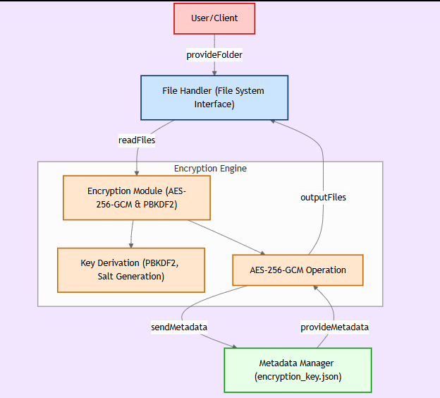

#  Crypofolder - Folder Encryption System

## Overview
Crypofolder is a study project focused on creating a **secure AES-256-GCM encryption system** designed to protect all files inside a folder. It encrypts and decrypts files using a password, ensuring privacy and security with modern cryptographic standards.

## Features
- **AES-256-GCM encryption** for authenticated encryption
- Automatically generates a **random IV** for each file (AES-GCM's recommended 12-byte size)
- Uses **PBKDF2 key derivation** with a salt for enhanced protection
- Deletes the original files **after encryption** for added security
- Stores encryption metadata securely in **encryption_key.json**
- Decrypts files back to their original state, preserving file integrity and authentication


## Installation
### 1. Install Dependencies
Make sure you have Python installed, then install the required library:
```bash
pip install cryptography
```

### 2. Clone This Repository
```bash
git clone https://github.com/marcovdss/crypofolder.git
cd crypofolder
```

## Usage
### Encrypt a Folder
Run the following command to encrypt all files in a folder:
```python
from crypofolder import encrypt_folder
encrypt_folder("/path/to/folder", "YourStrongPassword")
```
This will:
- Encrypt all files in the specified folder using AES-256-GCM
- Remove the original files after encryption
- Save the encryption metadata (salt) in `encryption_key.json`

### Decrypt a Folder
To restore the original files, run:
```python
from crypofolder import decrypt_folder
decrypt_folder("/path/to/folder", "YourStrongPassword")
```
This will:
- Decrypt all `.enc` files back to their original form
- Restore the original files to their previous state
- Delete the `encryption_key.json` after decryption

## How It Works

1. A **random salt** is generated for key derivation (PBKDF2 with SHA-256)
2. A **32-byte AES key** is derived from the password using PBKDF2
3. Each file is encrypted using **AES-256 in GCM mode**, ensuring both encryption and authentication
4. The encrypted file is stored with a `.enc` extension and includes the IV and authentication tag for verification
5. Original files are **deleted** to prevent unauthorized access

## Security Considerations
- **Do not lose your password!** The files **cannot** be decrypted without it.
- The encryption key is derived using **PBKDF2** for extra protection against brute-force attacks.
- The `encryption_key.json` file only stores the salt (not the password or encryption key), ensuring greater security.
- The use of **AES-GCM** provides both confidentiality and integrity verification, helping to protect against tampering.
- Consider storing encrypted backups in a secure location.

## License
This project is licensed under the **MIT License**. See the [LICENSE](LICENSE) file for more information.

## Author
👤 **Marcovdss**  
🔗 [GitHub](https://github.com/marcovdss)  
📧 marcos.vdss@outlook.com  
